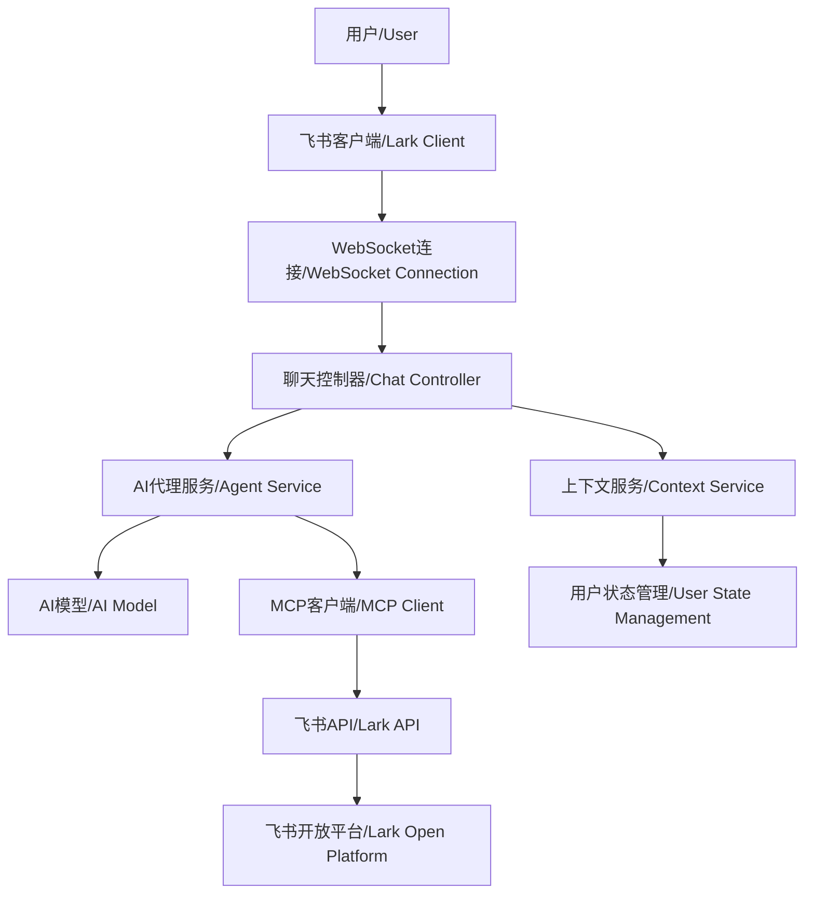

# 飞书MCP智能助手机器人Demo / Lark MCP Intelligent Assistant Bot Demo

## 项目简介 / Project Overview

这是一个基于飞书开放平台和 AI 模型的智能助手机器人 Demo 项目，通过集成 MCP(Model Context Protocol)协议，为用户提供智能对话和工具调用能力。

This is an intelligent assistant bot demo project based on Lark Open Platform and AI models, integrating MCP (Model Context Protocol) to provide users with intelligent conversation and tool calling capabilities.

## 项目架构 / Project Architecture

```
src/
├── app.ts                 # 应用入口 / Application entry
├── config/
│   └── index.ts          # 配置管理 / Configuration management
├── controller/
│   └── chat.ts           # 聊天控制器 / Chat controller
├── provider/             # 提供者抽象层 / Provider abstraction layer
│   ├── lark.ts           # 飞书平台实现 / Lark platform implementation
│   └── type.ts           # 类型定义 / Type definitions
├── service/              # 核心服务层 / Core service layer
│   ├── agent.ts          # AI代理服务 / AI agent service
│   ├── context.ts        # 上下文管理 / Context management
│   ├── lark.ts           # 飞书API服务 / Lark API service
│   └── mcp.ts            # MCP客户端服务 / MCP client service
├── util/                 # 工具函数 / Utility functions
│   ├── index.ts          # 通用工具 / Common utilities
│   └── message.ts        # 消息处理 / Message processing
└── prompt/
    └── index.ts          # 系统提示词 / System prompts
```

### 架构说明 / Architecture Description



## 安装和配置 / Installation and Configuration

### 环境要求 / Prerequisites

- Node.js >= 18.0.0
- npm >= 8.0.0 或 yarn >= 1.22.0 
- 飞书开放平台应用 / Lark Open Platform Application
- AI 模型 API 访问权限 / AI Model API Access

### 1. 克隆项目 / Clone Project

```bash
git clone <repository-url>
cd mcp-larkbot-demo/node
```

### 2. 安装依赖 / Install Dependencies

```bash
npm install
```

### 3. 环境配置 / Environment Configuration

创建 `.env` 文件并配置以下环境变量 / Create `.env` file and configure the following environment variables:

```env
# 飞书应用配置 / Lark Application Configuration
APP_ID=your_app_id
APP_SECRET=your_app_secret

# AI模型配置 / AI Model Configuration
OPENAI_BASE_URL=https://api.openai.com/v1
OPENAI_MODEL=gpt-4
OPENAI_API_KEY=your_api_key

# 服务器配置 / Server Configuration
PORT=3000
```

### 4. 飞书应用配置 / Lark Application Configuration

在飞书开放平台控制台中配置：
Configure in Lark Open Platform Console:

1. **机器人配置 / Bot Configuration**

   - 启用机器人功能 / Enable bot functionality
   - 配置消息接收 URL（如果需要） / Configure message receiving URL (if needed)

2. **权限配置 / Permission Configuration**

   - 添加必要的 API 权限 / Add necessary API permissions
   - 配置 OAuth 重定向 URL: `http://localhost:3000/callback`

3. **事件订阅 / Event Subscription**
   - 订阅消息相关事件 / Subscribe to message-related events

## 使用方法 / Usage

### 启动服务 / Start Service

```bash
npm dev
```

服务启动后访问：`http://localhost:3000`
After service starts, visit: `http://localhost:3000`

### 用户交互流程 / User Interaction Flow

1. **添加机器人**: 在飞书中添加你的机器人应用 / Add bot: Add your bot application in Lark
2. **发送消息**: 向机器人发送任意消息 / Send message: Send any message to the bot
3. **授权登录**: 点击机器人发送的登录链接完成 OAuth 授权 / Authorization: Click the login link sent by the bot to complete OAuth
4. **开始对话**: 登录成功后即可与 AI 助手进行对话 / Start chatting: After successful login, you can chat with the AI assistant

### 特殊命令 / Special Commands

- `/clear` - 清除当前用户的对话上下文 / Clear current user's conversation context


## 核心组件说明 / Core Components

### 聊天控制器 (ChatController)

负责协调多个聊天提供者，处理消息路由和用户认证流程。
Responsible for coordinating multiple chat providers, handling message routing and user authentication flow.

### AI 代理服务 (AgentService)

管理 AI 模型的对话生成，处理工具调用和流式响应更新。
Manages AI model conversation generation, handles tool calls and streaming response updates.

### 上下文服务 (ContextService)

维护用户的对话历史、认证状态和 MCP 客户端连接。
Maintains user conversation history, authentication state, and MCP client connections.

### 飞书服务 (LarkService)

封装飞书开放平台 API 调用，提供消息发送、用户信息获取等功能。
Encapsulates Lark Open Platform API calls, provides message sending, user info retrieval, etc.

### MCP 客户端服务 (MCPClientService)

创建和管理 MCP 客户端连接，提供工具调用功能。
Creates and manages MCP client connections, provides tool calling functionality.

## 故障排除 / Troubleshooting

### 常见问题 / Common Issues

**Q: 机器人无法响应消息**
A: 检查 WebSocket 连接状态和事件订阅配置

**Q: OAuth 授权失败**
A: 验证回调 URL 配置和应用权限设置

**Q: AI 响应速度慢**
A: 检查 AI 模型 API 的网络连接和配置

**Q: 工具调用失败**
A: 确认 MCP 客户端连接状态和工具权限
